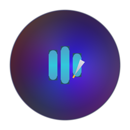
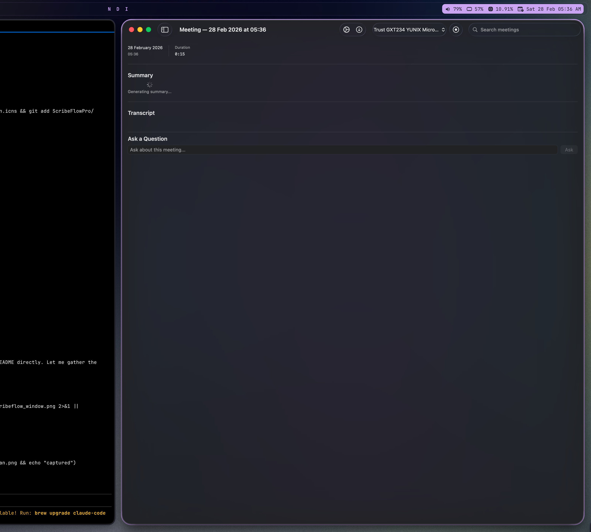

<p align="center">
  
</p>

<h1 align="center">ScribeFlow Pro</h1>

<p align="center">
  <strong>Your meetings. Your Mac. Nothing leaves.</strong>
</p>

<p align="center">
  
  
  
  
  
  
</p>

<p align="center">
  
</p>

---

ScribeFlow Pro is a **fully offline** macOS application that records meetings, transcribes them in real-time using on-device Whisper AI, and generates intelligent summaries with a local LLM. Everything runs on your Mac — no cloud, no subscriptions, no data leaves your machine. Ever.

## Why ScribeFlow Pro?

| Cloud transcription tools | ScribeFlow Pro |
|:---|:---|
| Your audio uploaded to third-party servers | **100% on-device** — zero network calls during operation |
| $20–30/month subscriptions | **Free forever** — bring your own open-source models |
| Requires constant internet | **Works offline** — airplane mode friendly |
| Vendor lock-in on your data | **You own everything** — local SQLite + plain audio files |
| Generic summaries | **Context-aware** — references your past meetings for smarter answers |

---

## Features

### On-Device Transcription
Record from any microphone and get real-time transcription powered by [MLX](https://github.com/ml-explore/mlx)-optimized Whisper models running natively on Apple Silicon. Speaker labels distinguish who said what.

### Local LLM Summarization
Generate structured meeting summaries, action items, and key decisions using locally-run models (Llama, Mistral, Qwen, Phi). Tokens stream in real-time — no waiting.

### Context Injection Engine
Ask questions about any meeting and get answers that draw from your **entire meeting history**. The LLM cross-references past discussions, decisions, and action items automatically.

### Meeting Knowledge Base
Every transcript, summary, and action item is persisted in SwiftData with full-text search. Your meetings become a searchable, private knowledge base that grows smarter over time.

### Liquid Glass Interface
A carefully crafted dark-mode UI with animated mesh gradients, organic pulse animations tied to recording state, and a glassmorphism aesthetic that feels native to macOS.

### Model Manager
Browse, download, and manage MLX-format models from Hugging Face directly in the app. Auto-detects locally installed models. SHA256 verification on every download.

---

## Quick Start

### Requirements

- macOS 15 (Sequoia) or later
- Apple Silicon (M1 / M2 / M3 / M4)
- 16 GB RAM recommended

### Install

```bash
# Clone the repo
git clone https://github.com/salvadalba/nodaysidle-scribeflow-pro.git
cd nodaysidle-scribeflow-pro

# Build & package
swift build -c release
bash Scripts/package_app.sh release

# Install
cp -R ScribeFlowPro.app /Applications/
open /Applications/ScribeFlowPro.app
```

### Download Models

ScribeFlow Pro auto-detects models in `~/Models/`. The fastest way to get started:

```bash
# Install git-lfs (if needed)
brew install git-lfs && git lfs install

# Whisper — transcription (~1.5 GB)
git clone https://huggingface.co/mlx-community/whisper-medium-mlx \
  ~/Models/mlx-community/whisper-medium-mlx

# Llama 3.2 — summarization & Q&A (~2 GB)
git clone https://huggingface.co/mlx-community/Llama-3.2-3B-Instruct-4bit \
  ~/Models/mlx-community/Llama-3.2-3B-Instruct-4bit
```

Or use the in-app Model Manager (toolbar arrow-down icon) to download models directly.

### Configure

1. Open **Settings** (gear icon) and select your downloaded Whisper + LLM models
2. Choose your microphone input
3. Click **Record** — you're live

---

## Recommended Models

| Purpose | Model | Size | Notes |
|:--------|:------|:-----|:------|
| Transcription (best) | `mlx-community/whisper-large-v3-mlx` | ~3 GB | Highest accuracy, needs more RAM |
| Transcription (fast) | `mlx-community/whisper-medium-mlx` | ~1.5 GB | Great balance for 16 GB machines |
| Summarization | `mlx-community/Llama-3.2-3B-Instruct-4bit` | ~2 GB | Fast, good quality summaries |

---

## Architecture

```
ScribeFlowPro/
├── Audio/                  # AudioCaptureActor — CoreAudio recording
├── ML/                     # WhisperTranscriptionActor, LLMInferenceActor,
│                           # SpeakerDiarizer — all Swift actors for thread safety
├── Models/                 # SwiftData entities (Meeting, TranscriptSegment,
│                           # SpeakerProfile, AppSettings, InstalledModel)
├── Services/               # SessionOrchestrator, SummarizationService,
│                           # ContextInjectionService, ModelManagerService
├── Views/                  # SwiftUI views with Liquid Glass design
│   ├── ContentView         # Main window with sidebar + detail
│   ├── MeetingSidebarView  # Searchable meeting list
│   ├── MeetingDetailView   # Summary, transcript, Q&A
│   ├── LiveTranscription   # Real-time streaming transcript
│   ├── LiquidGlass         # Animated mesh gradient background
│   └── ModelManagerView    # Download/manage models
└── Utilities/              # Logger extensions, helpers
```

### Key Design Decisions

| Decision | Rationale |
|:---------|:----------|
| **Swift actors** for all ML/audio | Thread-safe by construction under Swift 6 strict concurrency |
| **MLX** over Core ML | Direct weight loading from Hugging Face safetensors, no conversion step |
| **SwiftData** over Core Data | Modern persistence with automatic schema migrations |
| **`@Observable`** over `ObservableObject` | Observation framework — finer-grained updates, less boilerplate |
| **`AsyncStream`** for token output | Backpressure-aware streaming from actor-isolated inference loops |
| **No Combine** | Pure async/await — simpler mental model, better with actors |

---

## Tech Stack

| Layer | Technology |
|:------|:-----------|
| Language | Swift 6.0 (strict concurrency) |
| UI | SwiftUI + Observation framework |
| Persistence | SwiftData (VersionedSchema V1) |
| ML Inference | [MLX Swift](https://github.com/ml-explore/mlx-swift) 0.21+ |
| Tokenization | [swift-transformers](https://github.com/huggingface/swift-transformers) 0.1.12+ |
| Markdown | [swift-markdown-ui](https://github.com/gonzalezreal/swift-markdown-ui) 2.4+ |
| Audio | CoreAudio / AVFoundation |
| Build | Swift Package Manager (no Xcode project) |
| Packaging | Shell scripts (`Scripts/package_app.sh`) |

---

## Data & Privacy

ScribeFlow Pro is built on a simple principle: **your data never leaves your machine**.

- **Zero network calls** during operation — all transcription, summarization, and storage happen on-device
- **Audio files** saved locally to `~/Library/Application Support/ScribeFlowPro/Audio/`
- **Meeting data** stored in SwiftData (SQLite) within the app's container
- **ML models** stored at `~/Models/` — downloaded once, used forever offline
- **Temp files** auto-cleaned after 24 hours
- **No telemetry, no analytics, no tracking** — not even crash reports leave your Mac

---

## Development

```bash
# Build (debug)
swift build

# Build (release)
swift build -c release

# Run tests
swift test

# Package as .app
bash Scripts/package_app.sh release

# Dev loop (kill, build, launch)
bash Scripts/compile_and_run.sh
```

---

## Roadmap

- [ ] Export meetings to Markdown / PDF
- [ ] Keyboard shortcuts for record/stop/summarize
- [ ] Meeting templates (standup, 1:1, all-hands)
- [ ] Speaker enrollment for better diarization
- [ ] Sparkle auto-updates
- [ ] Menu bar quick-record widget

---

## License

MIT — do whatever you want with it.

---

<p align="center">
  <sub>Built with SwiftUI, MLX, and zero cloud dependencies.</sub><br />
  <sub>Made by <a href="https://github.com/salvadalba">@salvadalba</a></sub>
</p>
